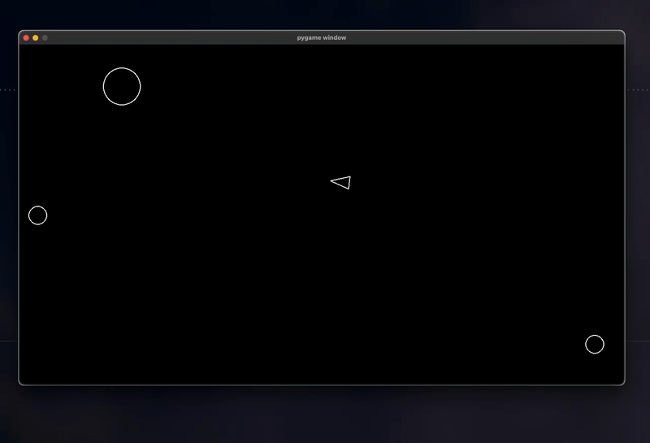

# 🚀 Asteroids in Pygame 🌠

A classic Asteroids-style game implemented in Python using Pygame, showcasing Object-Oriented Programming principles! 🎮

Project by Cello ([@laztaxon](https://github.com/laztaxon)) as part of an Object Oriented Programming course.

**Note: This is version 1.0 of the game. Visuals and mechanics may change in future updates.**



## 🕹️ Controls

- **W**: Move forward
- **S**: Move backward
- **A**: Rotate left
- **D**: Rotate right
- **Spacebar**: Shoot
- **Up Arrow**: Increase background opacity
- **Down Arrow**: Decrease background opacity
- **Escape**: Return to menu (during gameplay) or exit game (from menu)
- **Enter**: Start game (from menu) or return to menu (from game over screen)

Shoot asteroids to split them into smaller pieces. Be careful not to collide with them!

## 🛠️ Setup and Installation

1. Ensure you have Python 3.10 or later installed on your system. 🐍
   You can download it from [python.org](https://www.python.org/downloads/).

2. Clone this repository:
   ```
   git clone https://github.com/laztaxon/asteroids_py.git
   cd asteroids_py
   ```

3. Run the setup script:
   - On Windows:
     ```
     setup.bat
     ```
   - On macOS and Linux:
     ```
     chmod +x setup.sh  # Make the script executable (first time only)
     ./setup.sh
     ```

   This script will create a virtual environment, install the required packages, and set up the game to run globally.

## 🎮 Running the Game

After running the setup script, you can start your space adventure from anywhere by simply typing:

- On Windows:
  ```
  run_asteroids.bat
  ```
- On macOS and Linux:
  ```
  asteroids
  ```

You may need to restart your terminal or command prompt for the changes to take effect.

When you start the game, you'll be presented with a menu screen. Press Enter to start the game. If you lose, you'll see a game over screen, from which you can return to the menu.

## 🔄 Updating the Game

To update the game to the latest version:

1. Navigate to the game directory:
   ```
   cd path/to/asteroids_py
   ```

2. Pull the latest changes:
   ```
   git pull origin main
   ```

3. Run the setup script again to ensure all dependencies are up to date:
   - On Windows: `setup.bat`
   - On macOS and Linux: `./setup.sh`

After updating, you may need to restart your terminal or command prompt for any changes to take effect.

## 🔧 Troubleshooting

If you encounter any issues running the game, try the following:

1. Ensure you're using Python 3.10 or later.
2. Make sure you've run the setup script as described in the Setup and Installation section.
3. If you're on macOS or Linux and the `asteroids` command isn't found, try running:
   ```
   sudo ln -sf /path/to/your/asteroids_py/asteroids /usr/local/bin/asteroids
   ```
   Replace `/path/to/your/asteroids_py` with the actual path to your game directory.
4. If you encounter permission issues, you may need to run:
   ```
   sudo chmod +x /usr/local/bin/asteroids
   ```
5. If you're still having issues, please open an issue on the GitHub repository with details about the error you're encountering.

## 🚀 Future Extensions

- [x] Implement setup scripts & global command
- [x] Add a background image
- [x] Add game states (menu, playing, game over screens)
- [ ] Add a scoring system
- [ ] Make the objects wrap around the screen instead of disappearing
- [ ] Implement multiple lives and respawning
- [ ] Add acceleration to the player movement
- [ ] Add an explosion effect for the asteroids
- [ ] Make the ship have a triangular hit box instead of a circular one
- [ ] Add a shield power-up
- [ ] Add a speed power-up
- [ ] Add a game over screen
- [ ] Add a beginning screen
- [ ] Make the asteroids lumpy instead of perfectly round
- [ ] Create different weapon types
- [ ] Add bombs that can be dropped
- [ ] Implement power-ups and special abilities
- [ ] Add sound effects and background music
- [ ] Add different enemy types
- [ ] Create a high-score system
- [ ] Design additional levels with increasing difficulty
- [ ] Develop multiplayer functionality

## 🔧 Implemented Features

- **Setup Scripts & Global Command**: Implemented setup scripts for Windows (.bat) and macOS/Linux (.sh) to create a virtual environment, install required packages, and set up the game to run globally. Users can now start the game from anywhere using simple commands.

- **Background Image with Adjustable Opacity**: Added a space-themed background image with adjustable opacity. Players can increase or decrease the background opacity using the Up and Down arrow keys.

- **Game States**: Implemented different game states including a start menu, active gameplay, and a game over screen. This provides a more complete game loop and user experience.
